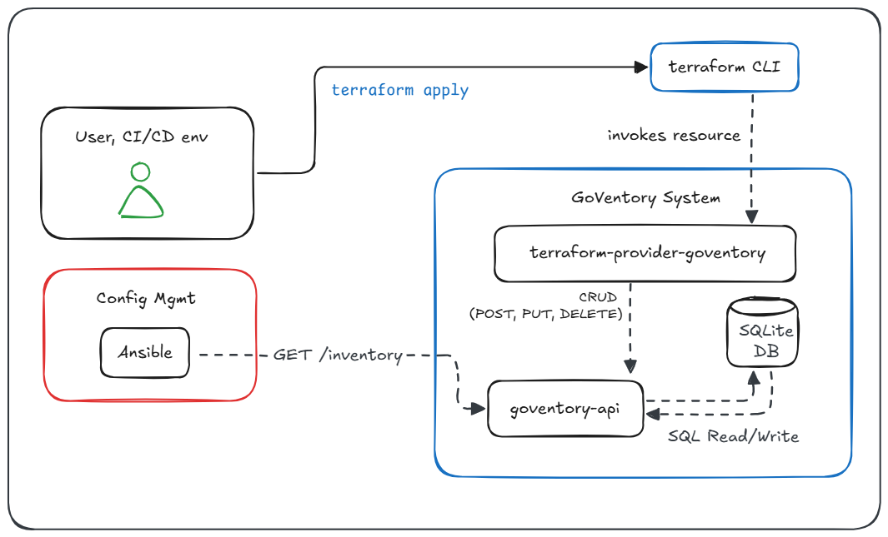

# GoVentory ── .✦

GoVentory is a minimal, API-driven Ansible inventory manager written in Go, with a corresponding Terraform provider for automation.

## High Level Design

## Components

- `goventory-api`: A Go-based REST API for managing inventory hosts.
- `terraform-provider-goventory`: A Terraform provider for managing `goventory-api` resources.

## How to Build and Use

### 1. Run the GoVentory API

The API server uses a SQLite database (`goventory.db`) to store the inventory.

```bash
# Navigate to the API directory
cd goventory-api

# Tidy dependencies
go mod tidy

# Run the server (defaults to port 8080)
go run main.go
```

### 2. Build and Install the Terraform Provider

```bash
# Navigate to the provider directory
cd terraform-provider-goventory

# Build and install the provider locally
go install .
```

### 3. Configure Terraform

Create a `.terraformrc` file in your home directory (`~\.terraformrc`) with the following content to tell Terraform where to find the local provider.

```hcl
provider_installation {
  dev_overrides {
    "hashicorp.com/edu/goventory" = "<your-go-bin-directory>"
  }
  direct {}
}
```

### 4. Use the Provider

Create a `main.tf` file:

```terraform
terraform {
  required_providers {
    goventory = {
      source  = "hashicorp.com/edu/goventory"
      version = "dev"
    }
  }
}

provider "goventory" {
  server_url = "http://localhost:8080"
}

resource "goventory_host" "web1" {
  hostname   = "web-1.example.com"
  ip_address = "192.168.1.10"
  host_group = "webservers"
}
```

Then, run Terraform:

```bash
# Initialize Terraform
terraform init

# Create the host
terraform apply
```
